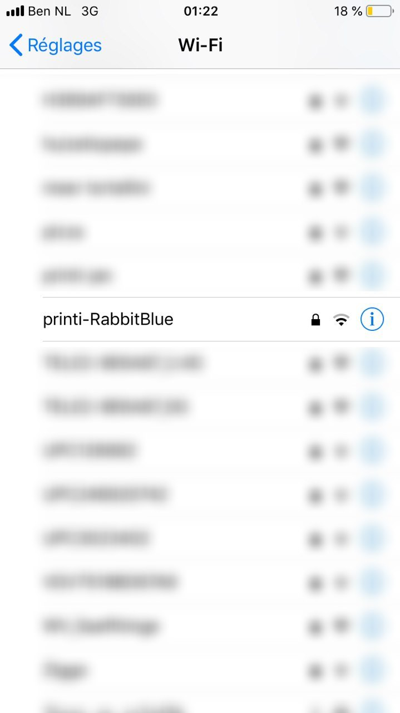
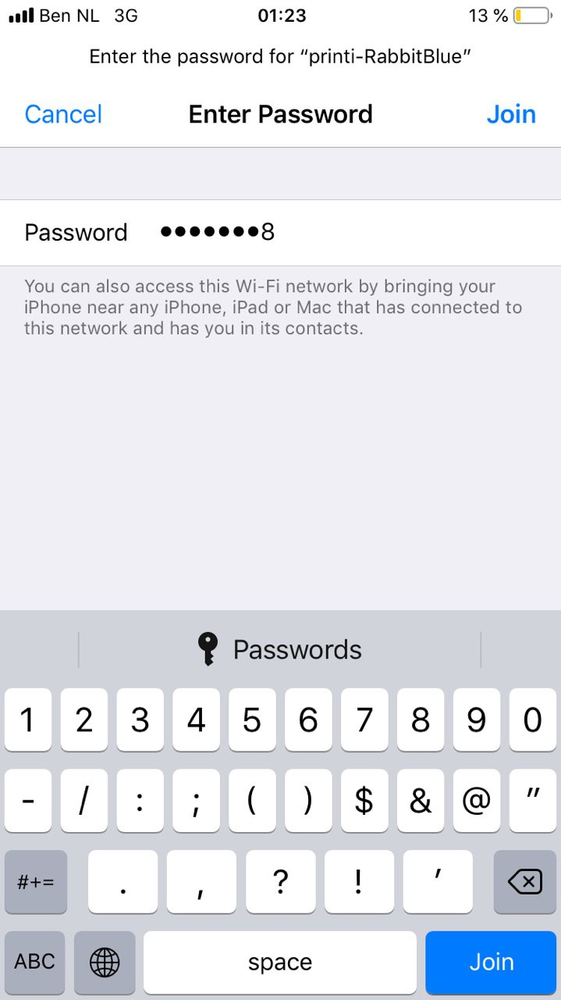
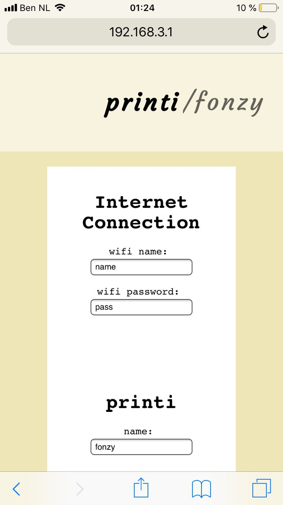
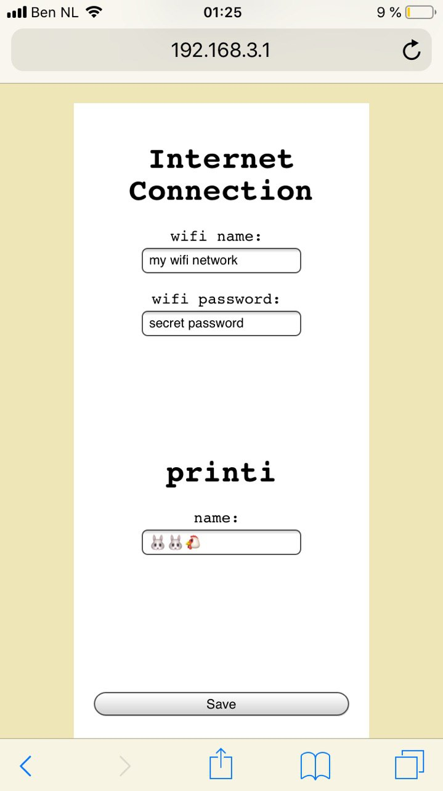

# How to open the settings page of your printi mini

## Step 1:
On your phone/laptop, connect to the wifi network emitted by your printi:

```
      Name: printi-*****
  Password: 12345678
```






## Step 2:

After connecting, open a web browser and navigate to:
```http://192.168.3.1/```



## Step 3:
Type in the name and password of the Wi-Fi network that you want your printi to connect to, and press `Save`.



## Tip: 
The settings page can also be used to change the name of your printer!

------

That's it! **Happy printing!**
